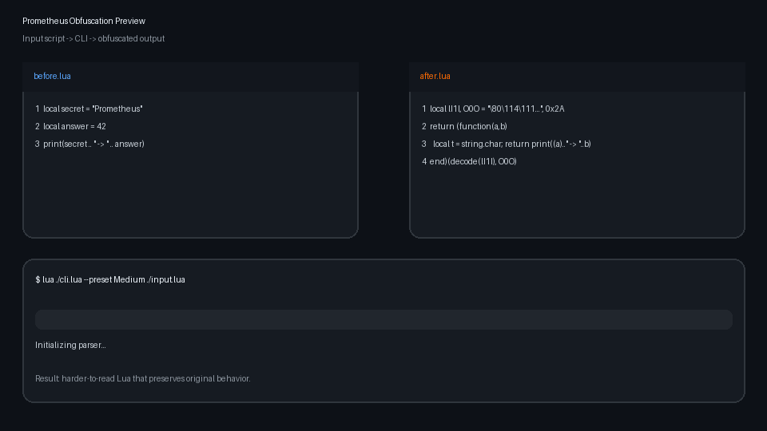

# :fire: Prometheus Lua Obfuscator
[](https://github.com/prometheus-lua/Prometheus/actions/workflows/Test.yml)

Prometheus is a Lua obfuscator written in pure Lua.
It uses several AST-based transformations including Control-Flow Flattening, Constant Encryption and more.

This project was inspired by the amazing [javascript-obfuscator](https://github.com/javascript-obfuscator/javascript-obfuscator).  
It can currently obfuscate Lua51 and Roblox's LuaU, however LuaU support is not finished yet.

You can find the full Documentation including a getting started guide [here](https://levno-710.gitbook.io/prometheus/).

Prometheus has an official [Discord server](https://discord.gg/U8h4d4Rf64).

<p align="center">
  
</p>

## Installation
To install Prometheus, simply clone the GitHub repository using:

```batch
git clone https://github.com/prometheus-lua/Prometheus.git
```

Alternatively you can download the sources [here](https://github.com/prometheus-lua/Prometheus/archive/refs/heads/master.zip).

Prometheus also Requires LuaJIT or Lua51 in order to work. The Lua51 binaries can be downloaded [here](https://sourceforge.net/projects/luabinaries/files/5.1.5/Tools%20Executables/).

## Usage
To quickly obfuscate a script:
```batch
lua ./cli.lua --preset Medium ./your_file.lua
```

### Example output
```lua
-- input.lua
print("Hello, World!");
```

```lua
-- input.obfuscated.lua
return(function(...)local L={"afT6mf1V","/7mJXsuvmE1c/fT3";"tn1ZSn6=","37ghSJM=";"WqermfWAWuuZpb3XX7M=","tqXGSJ3u","XQXpL9x21dxAWJa//p==","SrM=";"3q+5SJM=","/D==";"t7XUt0p=";"mIeOmIx9";"LdgrBfWdWuNABsb+KJxj","SJWJ4dahKsebW7t+KQv=","/cDu3AvP/D==";"Llv7uD==","tJWhFfTE";"TQ43ctIuy9HIop==","mEu93p==";"WJax1sXEXEaxWuxGt6==","t0gPSEp=",...
-- remaining obfuscated output omitted
```

For more advanced use cases see the [Documentation](https://levno-710.gitbook.io/prometheus/).
## Tests
To perform the Prometheus Tests, just run
```batch
lua ./tests.lua [--Linux]
```

## License and Commercial Use

Prometheus is licensed under the Prometheus License, a modified MIT-style license.
You are free to use, modify, and distribute this software, including for commercial purposes, under the following conditions:
 - Any commercial product, wrapper, or service (including SaaS or hosted solutions) that uses or integrates Prometheus must include clear attribution to:
```
Based on Prometheus by Elias Oelschner, https://github.com/prometheus-lua/Prometheus
```
 - The attribution must be visible in the product’s UI, documentation, and public website.
 - The obfuscated output files generated by Prometheus do not need to include any license or copyright notice.
 - Derivative works and public forks must also include a statement in their README noting that they are based on Prometheus.

Full license text: [Prometheus License](https://github.com/levno-710/Prometheus/blob/master/LICENSE)
